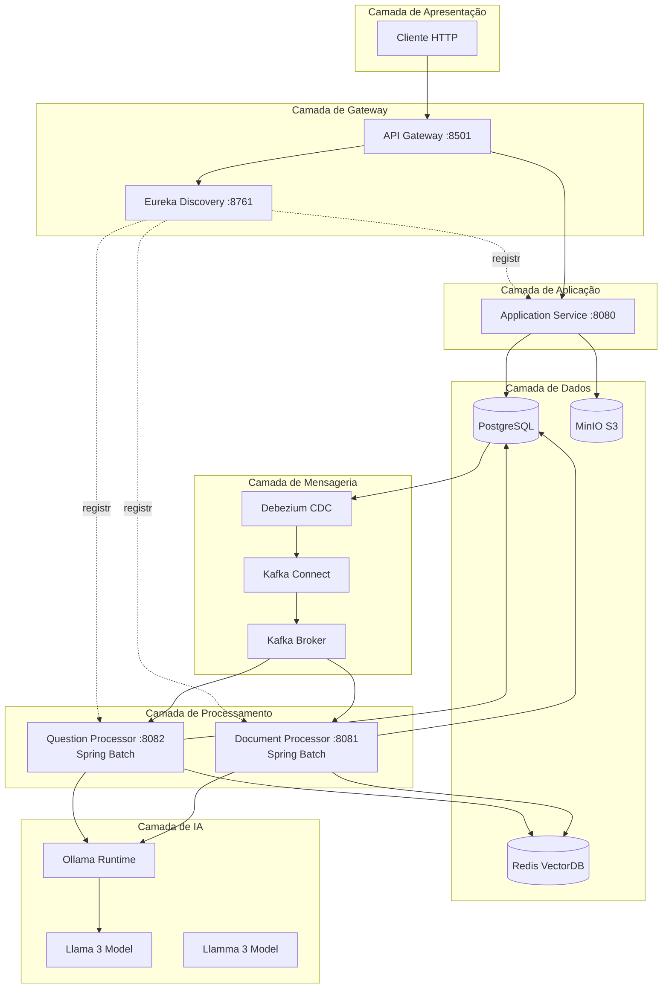
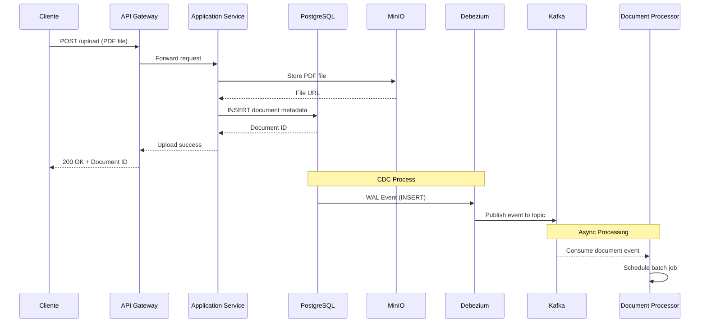
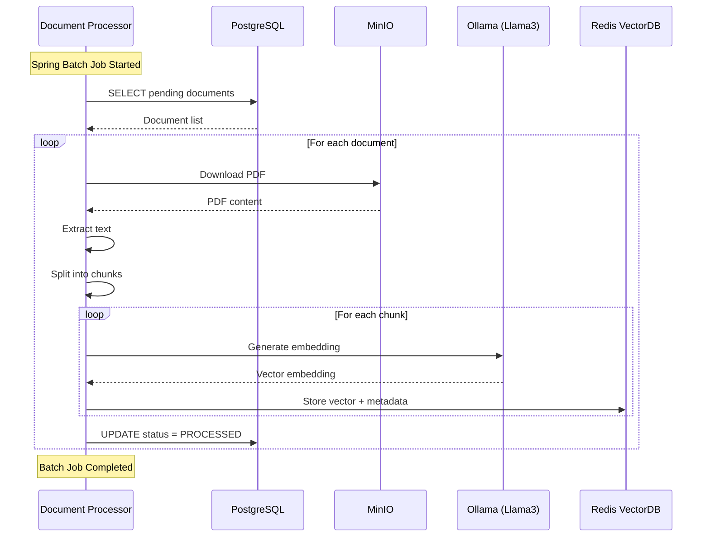
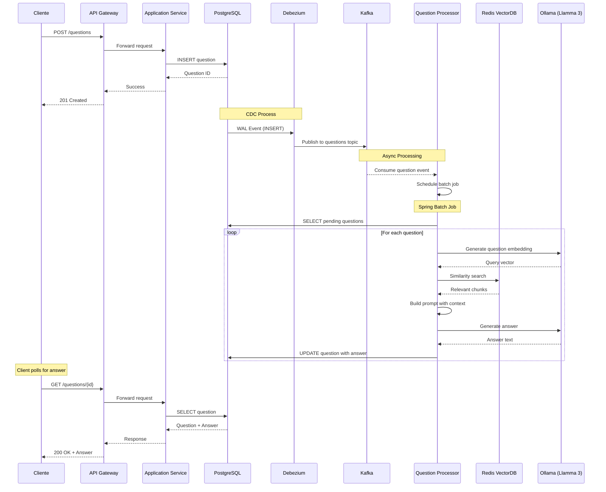
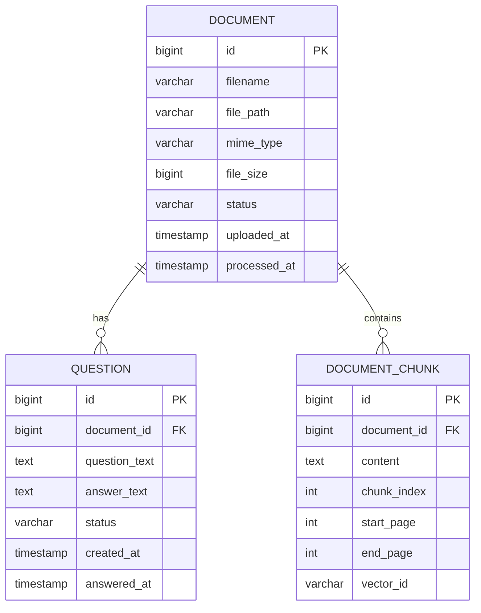
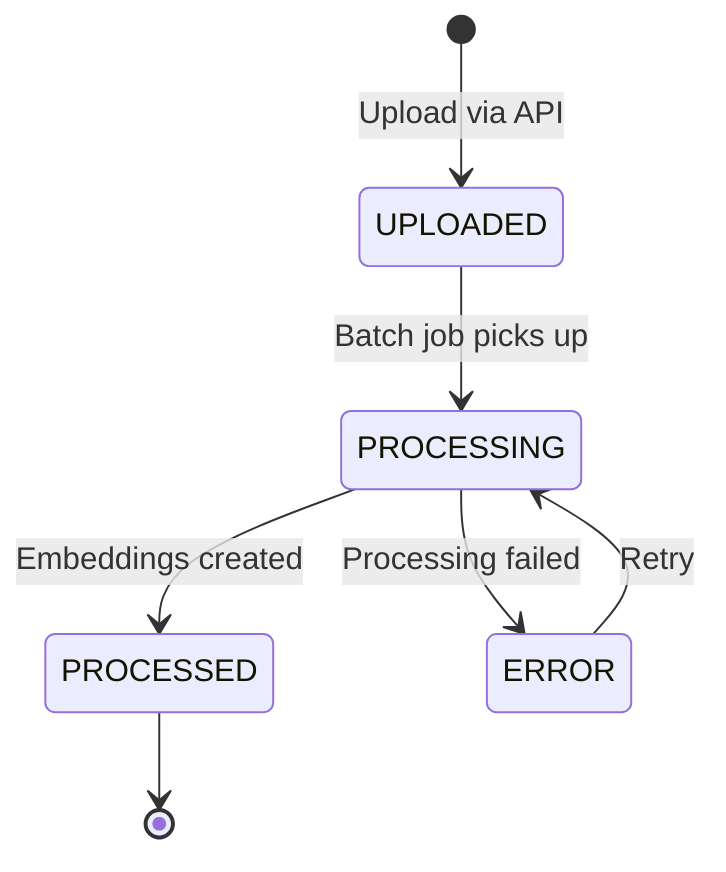
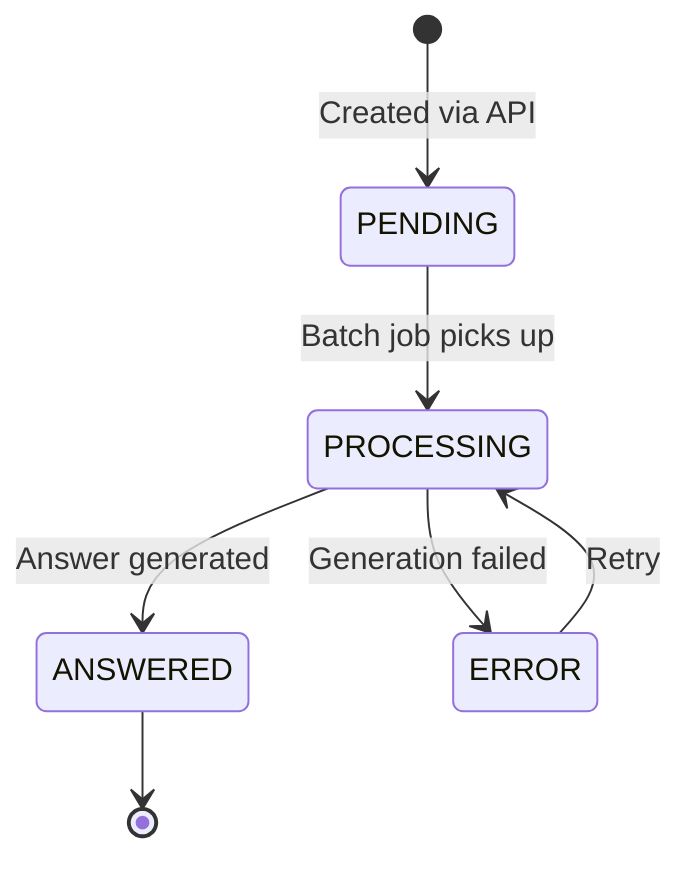

# Arquitetura Detalhada - IADoc

Este documento fornece uma visão detalhada da arquitetura do sistema IADoc.

## Índice

- [Visão Geral](#visão-geral)
- [Diagrama de Componentes](#diagrama-de-componentes)
- [Diagrama de Sequência](#diagrama-de-sequência)
- [Modelo de Dados](#modelo-de-dados)
- [Padrões de Design](#padrões-de-design)
- [Decisões de Arquitetura](#decisões-de-arquitetura)

## Visão Geral

IADoc é uma plataforma de microsserviços que utiliza:
- **Arquitetura orientada a eventos** (Event-Driven Architecture)
- **CQRS** (Command Query Responsibility Segregation) parcial
- **Event Sourcing** através do CDC
- **Domain-Driven Design** nos microsserviços

## Diagrama de Componentes



## Diagrama de Sequência

### 1. Upload de Documento



### 2. Processamento de Documento (RAG)



### 3. Cadastro e Processamento de Pergunta



## Modelo de Dados

### Esquema de Banco de Dados



### Estados do Documento



### Estados da Pergunta



## Padrões de Design

### 1. Event-Driven Architecture

**Vantagens:**
- Desacoplamento entre serviços
- Escalabilidade independente
- Processamento assíncrono
- Resiliência a falhas

**Implementação:**
- CDC com Debezium captura eventos do PostgreSQL
- Kafka transporta eventos entre microsserviços
- Consumers processam eventos de forma assíncrona

### 2. CQRS (Command Query Responsibility Segregation)

**Separação:**
- **Commands**: Application Service (writes)
- **Queries**: Application Service (reads)
- **Processors**: Processamento assíncrono

**Benefícios:**
- Otimização independente de leitura/escrita
- Escalabilidade diferenciada
- Modelos de dados especializados

### 3. Repository Pattern

```java
public interface DocumentRepository extends JpaRepository<Document, Long> {
    List<Document> findByStatus(DocumentStatus status);
    Optional<Document> findByFilename(String filename);
}
```

### 4. Service Layer Pattern

```java
@Service
public class DocumentService {
    private final DocumentRepository repository;
    private final MinioClient minioClient;
    
    @Transactional
    public Document uploadDocument(MultipartFile file) {
        // Lógica de negócio
    }
}
```

### 5. Batch Processing Pattern

```java
@Configuration
public class DocumentProcessingJobConfig {
    @Bean
    public Job documentProcessingJob() {
        return jobBuilderFactory.get("documentProcessing")
            .incrementer(new RunIdIncrementer())
            .flow(processingStep())
            .end()
            .build();
    }
}
```

## Decisões de Arquitetura

### 1. Por que Microsserviços?

**Vantagens:**
- Escalabilidade independente de componentes
- Tecnologias específicas por serviço
- Deploy independente
- Isolamento de falhas

**Trade-offs:**
- Complexidade operacional aumentada
- Necessidade de orquestração
- Latência de rede entre serviços

### 2. Por que CDC (Debezium)?

**Alternativas Consideradas:**
- Polling do banco de dados
- APIs síncronas
- Message queues tradicionais

**Razões para CDC:**
- Zero impacto na aplicação
- Baixa latência
- Garantia de ordem de eventos
- Histórico completo de mudanças

### 3. Por que Redis como VectorDB?

**Alternativas Consideradas:**
- Pinecone
- Weaviate
- Milvus
- Qdrant

**Razões para Redis:**
- Simplicidade de setup
- Performance excelente
- Familiaridade da equipe
- Suporte nativo a vetores (Redis Stack)
- Custo zero (self-hosted)

### 4. Por que Spring Batch?

**Alternativas Consideradas:**
- Jobs agendados simples (ScheduledExecutorService)
- Apache Airflow
- Quartz Scheduler

**Razões para Spring Batch:**
- Integração nativa com Spring
- Gerenciamento de transações
- Restart automático em falhas
- Métricas e monitoramento
- Chunk-based processing

### 5. Por que Ollama?

**Alternativas Consideradas:**
- OpenAI API
- Anthropic Claude API
- Hugging Face Transformers
- LangChain

**Razões para Ollama:**
- Execução local (privacidade)
- Sem custos de API
- Controle total sobre modelos
- Suporte a múltiplos modelos
- Fácil integração com Spring AI

## Fluxo de Dados Detalhado

### 1. Write Path (Upload)

```
Cliente HTTP
    ↓
API Gateway (roteamento)
    ↓
Application Service
    ├─→ MinIO (arquivo PDF)
    └─→ PostgreSQL (metadados)
         ↓
    Debezium (CDC)
         ↓
    Kafka Topic
         ↓
    Document Processor (consumer)
```

### 2. Processing Path (RAG)

```
Document Processor
    ├─→ MinIO (download PDF)
    ├─→ Text Extraction
    ├─→ Chunking
    ├─→ Ollama (embeddings)
    └─→ Redis VectorDB
         ↓
    PostgreSQL (update status)
```

### 3. Read Path (Query)

```
Cliente HTTP
    ↓
API Gateway
    ↓
Application Service
    └─→ PostgreSQL (query)
         ↓
    Response
```

### 4. Answer Generation Path

```
Question Processor
    ├─→ PostgreSQL (get question)
    ├─→ Ollama (question embedding)
    ├─→ Redis (similarity search)
    ├─→ Prompt Template (build context)
    ├─→ Ollama (generate answer)
    └─→ PostgreSQL (save answer)
```

## Configurações de Performance

### 1. Spring Batch

```yaml
spring:
  batch:
    job:
      enabled: false  # Jobs iniciados manualmente
    jdbc:
      initialize-schema: always
```

**Chunk Size**: 10 documentos por vez
**Thread Pool**: 4 threads para processamento paralelo

### 2. Kafka

**Topics:**
- `dbserver.public.documents` - Replicação de documentos
- `dbserver.public.questions` - Replicação de perguntas

**Configurações:**
- Replication Factor: 1 (dev) / 3 (prod)
- Partitions: 3
- Retention: 7 days

### 3. Redis

**Configurações:**
- Vector Dimensions: 768 (Llama 3)
- Similarity Algorithm: COSINE
- Index Type: HNSW (Hierarchical Navigable Small World)

### 4. PostgreSQL

**Pool de Conexões:**
- Minimum: 5
- Maximum: 20
- Connection Timeout: 30s

**Índices:**
```sql
CREATE INDEX idx_document_status ON document(status);
CREATE INDEX idx_question_status ON question(status);
CREATE INDEX idx_question_document ON question(document_id);
```

## Monitoramento e Observabilidade

### Métricas Importantes

1. **Application Service**
   - Taxa de upload (requests/s)
   - Tempo de resposta da API
   - Erros HTTP (4xx, 5xx)

2. **Document Processor**
   - Documentos processados/hora
   - Taxa de falha de processamento
   - Tempo médio de processamento

3. **Question Processor**
   - Perguntas respondidas/minuto
   - Tempo médio de resposta
   - Qualidade das respostas (futura métrica)

4. **Infraestrutura**
   - Lag de consumo do Kafka
   - Uso de memória/CPU
   - Tamanho do VectorDB

### Logs Estruturados

```java
log.info("Document processed successfully",
    kv("documentId", documentId),
    kv("processingTime", duration),
    kv("chunks", chunkCount));
```

## Segurança

### 1. Autenticação (Planejado)
- OAuth2 / JWT
- API Keys para integrações

### 2. Autorização (Planejado)
- Role-Based Access Control (RBAC)
- Document-level permissions

### 3. Dados em Trânsito
- HTTPS obrigatório em produção
- TLS para Kafka e PostgreSQL

### 4. Dados em Repouso
- Encriptação de arquivos no MinIO
- Encriptação de dados sensíveis no PostgreSQL

## Disaster Recovery

### Backup

1. **PostgreSQL**: Backups diários automáticos
2. **MinIO**: Replicação para S3 (prod)
3. **Redis**: RDB snapshots a cada 15 minutos

### Recovery

- RTO (Recovery Time Objective): 1 hora
- RPO (Recovery Point Objective): 15 minutos

## Roadmap de Arquitetura

### Curto Prazo
- [ ] Implementar circuit breakers (Resilience4j)
- [ ] Adicionar cache distribuído (Hazelcast)
- [ ] Implementar rate limiting

### Médio Prazo
- [ ] Migrar para Kubernetes
- [ ] Implementar service mesh (Istio)
- [ ] Adicionar API Gateway authentication

### Longo Prazo
- [ ] Multi-region deployment
- [ ] Event Sourcing completo
- [ ] Machine Learning Ops (MLOps) pipeline
