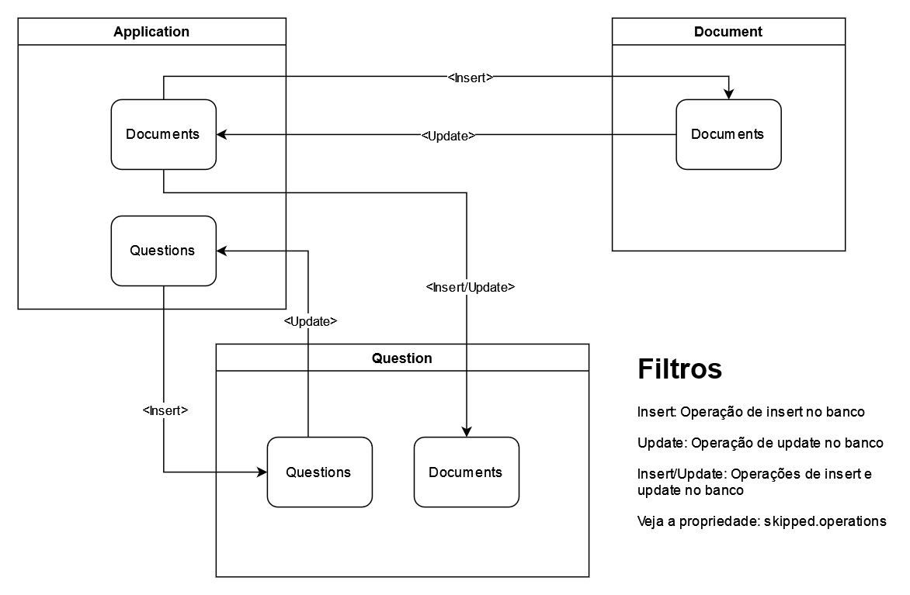

# IADoc - Projeto de microsserviços com upload de documentos, processamento de perguntas com RAG dos documentos e uso de Kafka, Debezium, CDC, Spring Batch, Spring Boot, Minio, Spring AI, Ollama e Llama 3 para respostas precisas.

[](https://www.gnu.org/licenses/gpl-3.0)
[](https://openjdk.org/)
[](https://spring.io/projects/spring-boot)
[](https://kafka.apache.org/)
[](https://redis.io/)

> Sistema de microsserviços para upload de documentos PDF, processamento inteligente via RAG (Retrieval-Augmented Generation) e respostas automatizadas a perguntas utilizando IA generativa.

## 📋 Índice

- [Sobre o Projeto](#-sobre-o-projeto)
- [Arquitetura](#-arquitetura)
- [Funcionalidades Principais](#-funcionalidades-principais)
- [Tecnologias Utilizadas](#-tecnologias-utilizadas)
- [Pré-requisitos](#-pré-requisitos)
- [Instalação e Configuração](#-instalação-e-configuração)
- [Execução](#-execução)
- [Uso da API](#-uso-da-api)
- [Estrutura do Projeto](#-estrutura-do-projeto)
- [Fluxo de Dados](#-fluxo-de-dados)
- [Roadmap](#-roadmap)
- [Contribuindo](#-contribuindo)
- [Licença](#-licença)
- [Contato e Suporte](#-contato-e-suporte)
- [Referências](#-referências)

## 🎯 Sobre o Projeto

**IADoc** é uma plataforma de microsserviços desenvolvida para processar documentos PDF de forma inteligente, permitindo que usuários façam perguntas sobre o conteúdo dos documentos e recebam respostas precisas geradas por IA.

### Problema que Resolve

- **Extração de Informações**: Facilita a extração de informações relevantes de grandes volumes de documentos PDF
- **Consultas Inteligentes**: Permite fazer perguntas em linguagem natural sobre o conteúdo dos documentos
- **Processamento Assíncrono**: Otimiza o uso de recursos de GPU através de processamento em lote
- **Escalabilidade**: Arquitetura de microsserviços permite escalar componentes individualmente

### Como Funciona

1. **Upload de Documentos**: Usuário faz upload de PDFs via API REST
2. **Replicação de Dados**: Sistema utiliza CDC (Change Data Capture) para replicar dados entre microsserviços
3. **Processamento RAG**: Documentos são processados e vetorizados usando técnicas de RAG
4. **Armazenamento Vetorial**: Vetores são armazenados no Redis para recuperação eficiente
5. **Perguntas e Respostas**: Usuário cadastra perguntas que são respondidas usando contexto recuperado do VectorDB

## 🏗️ Arquitetura

### Diagrama de Microsserviços

```
┌─────────────────────────────────────────────────────────────────┐
│                        API Gateway (8501)                        │
│                     (Spring Cloud Gateway)                       │
└────────────┬────────────────────────────────────┬────────────────┘
             │                                    │
    ┌────────▼────────┐                  ┌────────▼────────┐
    │   Discovery     │                  │   Application   │
    │    (Eureka)     │◄─────────────────┤  Microservice   │
    │     (8761)      │                  │     (8080)      │
    └─────────────────┘                  └────────┬────────┘
                                                  │
                                         ┌────────▼────────┐
                                         │   PostgreSQL    │
                                         │   (Documents)   │
                                         └────────┬────────┘
                                                  │
                                         ┌────────▼────────┐
                                         │  Debezium CDC   │
                                         │  Kafka Connect  │
                                         └────────┬────────┘
                                                  │
                          ┌───────────────────────┼───────────────────────┐
                          │                       │                       │
                  ┌───────▼────────┐      ┌───────▼────────┐      ┌──────▼──────┐
                  │  Kafka Topic   │      │  Kafka Topic   │      │   MinIO     │
                  │  (Documents)   │      │  (Questions)   │      │  (Storage)  │
                  └───────┬────────┘      └───────┬────────┘      └─────────────┘
                          │                       │
              ┌───────────▼───────────┐  ┌────────▼────────────┐
              │    Document           │  │    Question         │
              │    Processor          │  │    Processor        │
              │  (Spring Batch)       │  │  (Spring Batch)     │
              │  (8081)               │  │  (8082)             │
              └───────────┬───────────┘  └────────┬────────────┘
                          │                       │
                  ┌───────▼────────┐      ┌───────▼────────┐
                  │  Redis Vector  │      │  Ollama LLM    │
                  │      DB        │◄─────┤  (Llama 3)     │
                  └────────────────┘      └────────────────┘
```

### Componentes Principais

#### 1. **Microservice Application** (Porta 8080)
- **Responsabilidade**: Gerenciamento de uploads e cadastro de perguntas
- **Endpoints**: API REST para upload de PDFs e CRUD de perguntas
- **Banco de Dados**: PostgreSQL (armazena metadados de documentos e perguntas)
- **Storage**: MinIO (armazena arquivos PDF)

#### 2. **Microservice Document Processor** (Porta 8081)
- **Responsabilidade**: Processamento de documentos usando RAG
- **Tecnologia**: Spring Batch (jobs agendados)
- **Processamento**:
  - Extração de texto dos PDFs
  - Chunking (divisão em pedaços menores)
  - Embedding (vetorização com Llama 3)
  - Armazenamento no Redis VectorDB
- **Consumo**: Kafka topic de documentos

#### 3. **Microservice Question Processor** (Porta 8082)
- **Responsabilidade**: Responder perguntas cadastradas
- **Tecnologia**: Spring Batch (jobs agendados)
- **Processamento**:
  - Recuperação de contexto relevante do VectorDB
  - Construção de prompt com template
  - Geração de resposta via Llama 3
  - Persistência da resposta no banco
- **Consumo**: Kafka topic de perguntas

#### 4. **Microservice Discovery** (Porta 8761)
- **Responsabilidade**: Service Discovery
- **Tecnologia**: Eureka Server
- **Função**: Registro e descoberta de microsserviços

#### 5. **Microservice API Gateway** (Porta 8501)
- **Responsabilidade**: Gateway de entrada único
- **Tecnologia**: Spring Cloud Gateway
- **Função**: Roteamento, balanceamento de carga e segurança

### Infraestrutura

#### Change Data Capture (CDC)
```
PostgreSQL → Debezium Connector → Kafka Connect → Kafka Topics
```

- **Debezium**: Captura mudanças no PostgreSQL em tempo real
- **Kafka Connect**: Orquestra os conectores Debezium
- **Kafka Topics**: Canais de comunicação entre microsserviços

#### Vector Database
- **Redis**: Armazenamento de embeddings vetoriais
- **Busca por Similaridade**: Recuperação eficiente de contexto relevante

#### Object Storage
- **MinIO**: Armazenamento compatível com S3 para arquivos PDF

## ✨ Funcionalidades Principais

### 1. Upload de Documentos
- ✅ Upload de múltiplos arquivos PDF simultaneamente
- ✅ Armazenamento seguro no MinIO
- ✅ Metadados persistidos no PostgreSQL
- ✅ Replicação automática via CDC

### 2. Processamento de Documentos (RAG)
- ✅ Extração automática de texto
- ✅ Chunking inteligente do conteúdo
- ✅ Geração de embeddings com Llama 3
- ✅ Armazenamento vetorial no Redis
- ✅ Processamento em lote com Spring Batch

### 3. Sistema de Perguntas e Respostas
- ✅ Cadastro de perguntas vinculadas a documentos
- ✅ Recuperação de contexto relevante (RAG)
- ✅ Geração de respostas com Llama 3
- ✅ Histórico de perguntas e respostas

### 4. Observabilidade
- ✅ Service Discovery com Eureka
- ✅ API Gateway centralizado
- ✅ Logs estruturados

## 🛠️ Tecnologias Utilizadas

### Backend
- **Java 25**: Linguagem de programação
- **Spring Boot 3.x**: Framework principal
- **Spring Cloud**: Microsserviços (Gateway, Eureka)
- **Spring AI**: Integração com LLMs
- **Spring Batch**: Processamento em lote
- **Maven**: Gerenciamento de dependências

### Inteligência Artificial
- **Ollama**: Runtime para modelos LLM
- **Llama 3**: Modelo para embeddings
- **Llama 3**: Modelo para geração de respostas

### Dados e Mensageria
- **PostgreSQL**: Banco de dados relacional
- **Redis**: Vector Database
- **Apache Kafka**: Message Broker
- **Confluent Kafka Connect**: Plataforma CDC
- **Debezium**: Conector CDC para PostgreSQL

### Storage e Containerização
- **MinIO**: Object Storage (compatível S3)
- **Docker**: Containerização
- **Docker Compose**: Orquestração local

## 📋 Pré-requisitos

Antes de começar, certifique-se de ter instalado:

- **Docker Desktop** (com pelo menos 8GB de RAM alocados)
- **Java 25** ([Download aqui](https://openjdk.org/))
- **Maven 3.9+** ([Download aqui](https://maven.apache.org/))
- **Git** ([Download aqui](https://git-scm.com/))

### Requisitos de Sistema
- **RAM**: Mínimo 16GB (recomendado 32GB)
- **Disco**: Mínimo 20GB livres
- **GPU**: Opcional, mas recomendado para processamento mais rápido

## 🚀 Instalação e Configuração

### 1. Clonar o Repositório

```bash
git clone https://github.com/halissonmartins/IADoc.git
cd IADoc
```

### 2. Configurar Variáveis de Ambiente

#### Windows
```cmd
set UPLOAD_RECEIVED_DIR=D:\IADoc\data\documents\received\
```

#### Linux/Mac
```bash
export UPLOAD_RECEIVED_DIR=/home/usuario/IADoc/data/documents/received/
```

> ⚠️ **Importante**: Crie o diretório antes de executar:
> ```bash
> mkdir -p data/documents/received
> ```

### 3. Configurar Docker Hub (Opcional)

Se for fazer deploy das imagens:

**No arquivo `pom.xml` (raiz do projeto)**:
```xml
<properties>
    <user.docker.hub>SEU_USUARIO_DOCKERHUB</user.docker.hub>
</properties>
```

**No arquivo `docker-compose.yml`**:
```yaml
image: SEU_USUARIO_DOCKERHUB/microservice-application:latest
```

## 🎮 Execução

### Opção 1: Execução via IDE (Desenvolvimento)

#### Passo 1: Iniciar Infraestrutura

```bash
docker-compose -f docker-compose-infra.yml up -d
```

Aguarde 2-3 minutos para todos os containers inicializarem completamente. Você pode verificar o status com:

```bash
docker-compose -f docker-compose-infra.yml ps
```

#### Passo 2: Verificar Download do Modelo Ollama

Na primeira execução, o Ollama precisa baixar o modelo Llama 3 (~4GB). Verifique o progresso:

```bash
docker logs -f ollama
```

Aguarde até ver a mensagem indicando que o modelo foi carregado.

#### Passo 3: Iniciar Microsserviços (na ordem)

1. **microservice-discovery** (Eureka)
   - Aguarde até ver: `Started Eureka Server`
   - Acesse: http://localhost:8761

2. **microservice-api-gateway**
   - Aguarde até ver: `Netty started on port 8501`

3. **microservice-application**
   - Aguarde até ver: `Started ApplicationMicroserviceApplication`

4. **microservice-document-processor**
   - Aguarde até ver: `Started DocumentProcessorMicroserviceApplication`

5. **microservice-question-processor**
   - Aguarde até ver: `Started QuestionProcessorMicroserviceApplication`

#### Passo 4: Parar a Infraestrutura

```bash
docker-compose -f docker-compose-infra.yml down --volumes
```

### Opção 2: Execução Completa via Docker

#### Passo 1: Compilar o Projeto

```bash
mvn clean install
```

#### Passo 2: Gerar Imagens Docker

```bash
mvn spring-boot:build-image
```

> ℹ️ Este comando pode levar alguns minutos na primeira execução.

#### Passo 3: Iniciar Todos os Containers

```bash
docker-compose up -d
```

#### Passo 4: Verificar Status

```bash
docker-compose ps
```

Todos os serviços devem estar com status "Up".

#### Passo 5: Visualizar Logs

```bash
# Logs de todos os serviços
docker-compose logs -f

# Logs de um serviço específico
docker-compose logs -f microservice-application
```

#### Passo 6: Parar Todos os Containers

```bash
docker-compose down --volumes
```

## 📡 Uso da API

### Importar Coleção no Postman/Insomnia

O projeto inclui uma coleção pronta:
```
IA Documents.postman_collection.json
```

### Endpoints Disponíveis

#### 1. Upload de Documentos

**Endpoint**: `POST /upload`  
**Porta**: `8501` (via Gateway)

```bash
curl --location 'http://localhost:8501/upload' \
--form 'files=@"/caminho/para/documento.pdf"'
```

**Resposta de Sucesso**:
```json
{
  "documentId": 1,
  "filename": "documento.pdf",
  "status": "UPLOADED",
  "uploadDate": "2026-02-02T10:30:00"
}
```

#### 2. Cadastrar Pergunta

**Endpoint**: `POST /questions`  
**Porta**: `8501` (via Gateway)

```bash
curl --location 'http://localhost:8501/questions' \
--header 'Content-Type: application/json' \
--data '{
    "question": "Qual é o tema principal do documento?",
    "documentId": 1
}'
```

**Resposta de Sucesso**:
```json
{
  "questionId": 1,
  "question": "Qual é o tema principal do documento?",
  "documentId": 1,
  "status": "PENDING",
  "createdAt": "2026-02-02T10:35:00"
}
```

#### 3. Consultar Pergunta e Resposta

**Endpoint**: `GET /questions/{id}`  
**Porta**: `8501` (via Gateway)

```bash
curl --location 'http://localhost:8501/questions/1'
```

**Resposta de Sucesso** (após processamento):
```json
{
  "questionId": 1,
  "question": "Qual é o tema principal do documento?",
  "answer": "O documento aborda principalmente...",
  "documentId": 1,
  "status": "ANSWERED",
  "createdAt": "2026-02-02T10:35:00",
  "answeredAt": "2026-02-02T10:40:00"
}
```

#### 4. Listar Todas as Perguntas de um Documento

**Endpoint**: `GET /documents/{id}/questions`  
**Porta**: `8501` (via Gateway)

```bash
curl --location 'http://localhost:8501/documents/1/questions'
```

### Fluxo Completo de Uso

1. **Upload de PDF**: Faça upload de um documento
2. **Aguarde Processamento**: O job de documentos processa em lote (configurável)
3. **Cadastre Perguntas**: Cadastre uma ou mais perguntas sobre o documento
4. **Aguarde Respostas**: O job de perguntas processa e gera respostas
5. **Consulte Resultados**: Recupere as respostas via API

### Tempos de Processamento (Estimados)

- **Upload**: < 1 segundo
- **Processamento do Documento**: 2-5 minutos (dependendo do tamanho)
- **Geração de Resposta**: 30-60 segundos por pergunta

## 📁 Estrutura do Projeto

```
IADoc/
├── .github/
│   └── workflows/              # GitHub Actions (CI/CD)
├── asserts/
│   └── images/                 # Imagens e diagramas da documentação
├── cdc/                        # Configurações do Debezium CDC
│   └── connectors/             # Conectores Kafka
├── data/
│   └── documents/
│       └── received/           # Diretório para PDFs recebidos
├── database/
│   ├── init-scripts/           # Scripts de inicialização do PostgreSQL
│   └── migrations/             # Migrations do banco de dados
├── iadoc-library/              # Biblioteca compartilhada entre microsserviços
│   ├── src/
│   └── pom.xml
├── microservice-api-gateway/   # Gateway de entrada
│   ├── src/
│   └── pom.xml
├── microservice-application/   # Serviço de aplicação
│   ├── src/
│   └── pom.xml
├── microservice-discovery/     # Eureka Server
│   ├── src/
│   └── pom.xml
├── microservice-document-processor/  # Processador de documentos
│   ├── src/
│   └── pom.xml
├── microservice-question-processor/  # Processador de perguntas
│   ├── src/
│   └── pom.xml
├── docker-compose-infra.yml    # Infraestrutura (Kafka, DB, etc)
├── docker-compose.yml          # Todos os serviços
├── pom.xml                     # POM principal (parent)
├── README.md                   # Este arquivo
├── README.en.md                # README em inglês
└── LICENSE                     # Licença GPL-3.0
```

### Descrição dos Módulos

| Módulo | Descrição | Porta |
|--------|-----------|-------|
| **iadoc-library** | Biblioteca compartilhada com DTOs, utils e configurações comuns | N/A |
| **microservice-discovery** | Eureka Server para service discovery | 8761 |
| **microservice-api-gateway** | Spring Cloud Gateway para roteamento | 8501 |
| **microservice-application** | API REST para upload e CRUD | 8080 |
| **microservice-document-processor** | Jobs Batch para processar documentos | 8081 |
| **microservice-question-processor** | Jobs Batch para processar perguntas | 8082 |

## 🔄 Fluxo de Dados

### 1. Fluxo de Upload de Documento

```
Cliente → API Gateway → Application Service → PostgreSQL
                                            ↓
                                         MinIO
                                            ↓
                                    Debezium (CDC)
                                            ↓
                                      Kafka Topic
                                            ↓
                              Document Processor Service
                                            ↓
                                    Spring Batch Job
                                            ↓
                              Extração de Texto (PDF)
                                            ↓
                                   Chunking do Texto
                                            ↓
                              Embedding (Llama 3 / Ollama)
                                            ↓
                                    Redis Vector DB
```

### 2. Fluxo de Pergunta e Resposta

```
Cliente → API Gateway → Application Service → PostgreSQL
                                                   ↓
                                           Debezium (CDC)
                                                   ↓
                                             Kafka Topic
                                                   ↓
                                   Question Processor Service
                                                   ↓
                                          Spring Batch Job
                                                   ↓
                              Busca de Contexto (Redis VectorDB)
                                                   ↓
                                    Construção do Prompt
                                                   ↓
										LLM (Llama 3 / Ollama)
                                                   ↓
                                     Resposta Gerada
                                                   ↓
                                     PostgreSQL (Update)
                                                   ↓
                                   Cliente (via Consulta GET)
```

### 3. Diagrama de CDC (Change Data Capture)



**Explicação do Fluxo CDC**:

1. **Write-Ahead Log (WAL)**: PostgreSQL registra todas as mudanças no WAL
2. **Debezium Connector**: Lê o WAL e converte em eventos Kafka
3. **Kafka Topics**: Publica eventos de mudança (INSERT, UPDATE, DELETE)
4. **Consumers**: Microsserviços consomem eventos e processam

**Vantagens do CDC**:
- ✅ Baixa latência na replicação
- ✅ Zero impacto na aplicação principal
- ✅ Garantia de ordem de eventos
- ✅ Histórico completo de mudanças

## 🗺️ Roadmap

### ✅ Concluído
- [x] Arquitetura de microsserviços
- [x] Upload de documentos PDF
- [x] CDC com Debezium e Kafka
- [x] Processamento RAG com Spring AI
- [x] Vector DB com Redis
- [x] Jobs com Spring Batch
- [x] API Gateway e Service Discovery

### 🚧 Em Desenvolvimento
- [ ] Testes unitários e de integração
- [ ] Documentação do código (JavaDoc)
- [ ] Criação automática de tabelas Spring Batch via DDL

### 📅 Planejado
- [ ] Deploy com Kubernetes
- [ ] Integração com Cucumber (BDD)
- [ ] Integração com Spring Flow
- [ ] Monitoramento com Prometheus e Grafana
- [ ] Autenticação e autorização (OAuth2/JWT)
- [ ] Interface web (Frontend)
- [ ] Suporte a outros formatos (DOCX, TXT, etc)
- [ ] API de streaming de respostas (WebSocket)
- [ ] Cache distribuído (Hazelcast)
- [ ] Suporte multi-tenant

### 💡 Ideias Futuras
- [ ] Fine-tuning de modelos específicos
- [ ] Suporte a múltiplos idiomas
- [ ] Análise de sentimento em documentos
- [ ] Geração de sumários automáticos
- [ ] Exportação de respostas para PDF/DOCX

## 🤝 Contribuindo

Contribuições são muito bem-vindas! Para contribuir:

1. **Fork o Projeto**
2. **Crie uma Branch** para sua feature (`git checkout -b feature/MinhaFeature`)
3. **Commit suas mudanças** (`git commit -m 'feat: Adiciona MinhaFeature'`)
4. **Push para a Branch** (`git push origin feature/MinhaFeature`)
5. **Abra um Pull Request**

### Convenção de Commits

Seguimos o [Conventional Commits](https://www.conventionalcommits.org/):

- `feat:` Nova funcionalidade
- `fix:` Correção de bug
- `docs:` Documentação
- `style:` Formatação de código
- `refactor:` Refatoração
- `test:` Testes
- `chore:` Tarefas de manutenção

### Código de Conduta

Este projeto adota um Código de Conduta. Ao participar, você concorda em seguir suas diretrizes.

## 📄 Licença

Este projeto está licenciado sob a **GNU General Public License v3.0** - veja o arquivo [LICENSE](LICENSE) para detalhes.

**Resumo da Licença**:
- ✅ Uso comercial permitido
- ✅ Modificação permitida
- ✅ Distribuição permitida
- ⚠️ Deve manter a mesma licença
- ⚠️ Deve divulgar o código fonte
- ⚠️ Deve incluir aviso de licença

## 📞 Contato e Suporte

### Autor
**Halisson Martins**

- GitHub: [@halissonmartins](https://github.com/halissonmartins)
- LinkedIn: [linkedin.com/in/halissonmartins](https://linkedin.com/in/halissonmartins) *(ajuste se necessário)*
- Email: *(adicione se desejar)*

### Reportar Problemas

Encontrou um bug ou tem uma sugestão? [Abra uma issue](https://github.com/halissonmartins/IADoc/issues/new).

### Recursos Úteis

- 📚 [Documentação Spring AI](https://docs.spring.io/spring-ai/reference/index.html)
- 📚 [Documentação Debezium](https://debezium.io/documentation/reference/stable/)
- 📚 [Ollama Documentation](https://ollama.ai/docs)
- 📚 [Spring Batch Guide](https://spring.io/guides/gs/batch-processing)

## 📚 Referências

### Change Data Capture (CDC)
- [Debezium Documentation](https://debezium.io/documentation/reference/stable/)
- [Using Debezium SMT for Groovy Filter Routing Events](https://developers.redhat.com/articles/2023/07/06/how-use-debezium-smt-groovy-filter-routing-events)
- [Debezium Tutorial - YouTube](https://youtu.be/0_Fm-xr3LY8?si=v2rjM9mDmOb1icrA)
- [Debezium with SMT - Medium](https://medium.com/trendyol-tech/debezium-with-simple-message-transformation-smt-4f5a80c85358)

### Spring AI e Vector Database
- [Spring AI with Ollama - YouTube](https://youtu.be/4-rG2qsTrAs?si=0LFTj5qkzjGwMFxT)
- [RAG with Spring AI - YouTube](https://youtu.be/ZoPVGrB8iHU?si=zNmMAC6962DvcsMl)
- [Spring AI Reference Documentation](https://docs.spring.io/spring-ai/reference/index.html)

### Upload de Arquivos
- [Spring File Upload Guide](https://spring.io/guides/gs/uploading-files)
- [Multipart File Upload REST API - Medium](https://medium.com/@patelsajal2/how-to-create-a-spring-boot-rest-api-for-multipart-file-uploads-a-comprehensive-guide-b4d95ce3022b)

### Spring Batch
- [Spring Batch Processing Guide](https://spring.io/guides/gs/batch-processing)
- [Spring Batch Tutorial - Toptal](https://www.toptal.com/spring/spring-batch-tutorial)
- [Introduction to Spring Batch - Medium](https://medium.com/@rostyslav.ivankiv/introduction-to-spring-batch-a2f39454573f)
- [Spring Batch Contact Importer](https://tucanoo.com/spring-batch-example-building-a-bulk-contact-importer/)
- [Repeating Steps in Spring Batch - Stack Overflow](https://stackoverflow.com/questions/29286699/repeating-a-step-x-times-in-spring-batch)

### MinIO Object Storage
- [Integrating MinIO with Spring Boot - Medium](https://gurselgazii.medium.com/integrating-minio-with-spring-boot-a-guide-to-simplified-object-storage-525d5a7686cc)
- [MinIO with Angular and Spring Boot - Medium](https://medium.com/@kapincev/a-developers-guide-to-integrating-minio-with-angular-and-spring-boot-3d77c13aefc7)

### Conditional Annotations
- [Conditional Annotations in Spring Boot](https://codingnconcepts.com/spring-boot/conditional-annotations-in-spring-boot/)

### Livros Gratuitos para Testes
- [Livros Abertos USP](https://www.livrosabertos.abcd.usp.br/portaldelivrosUSP)

---

<div align="center">

**⭐ Se este projeto foi útil para você, considere dar uma estrela!**

[](https://github.com/halissonmartins/IADoc)

</div>
